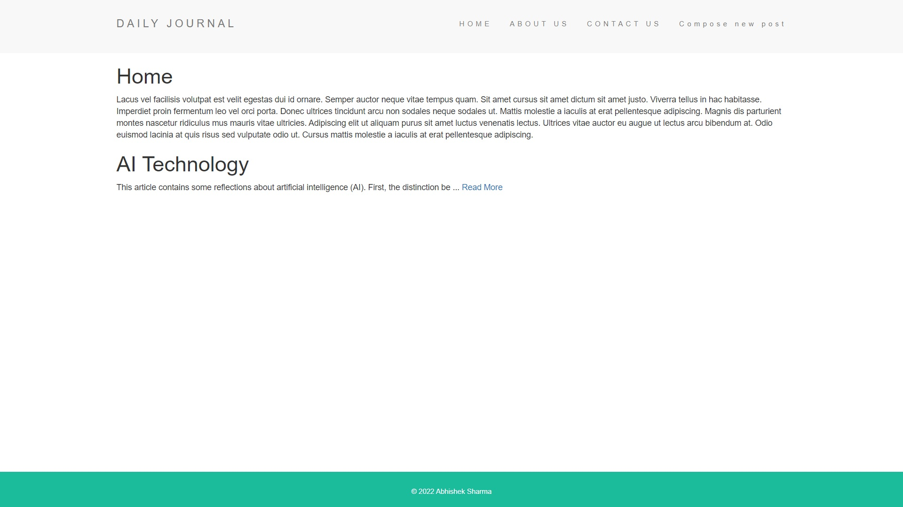
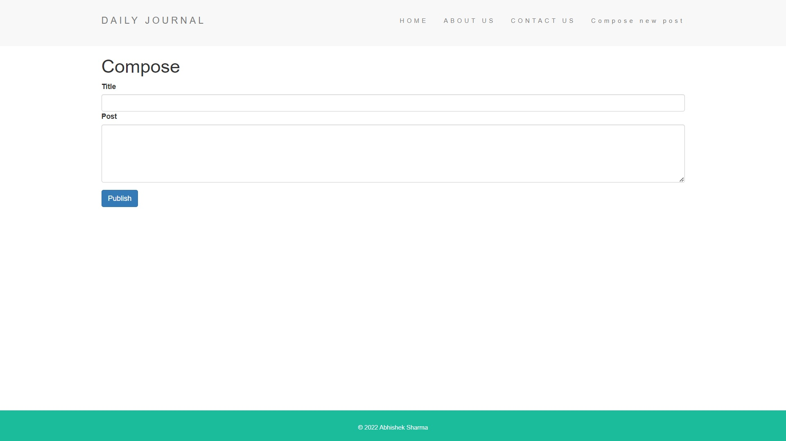

<h1 align="center">Daily Journal Blog</h1>

<p align="center">
</p>

<br/>

<p align="center">
</p>

<h2 align="center"><a href="https://journal-4eb0.onrender.com/">👆 Clike here for live demo 💻</a></h2>

---

## Description

### Daily Journal Blog Website

<p>Simple server side rendring website for news post.
</p>

---

## Technologies used
- EJS
- NodeJs
- ExpressJs
- Mongoose
- MongoDB Atlas cloud storage

---

## Features

- create news post
- read news post

---

## Web App Installation Instructions

- Clone daily journal project
- Go to the project directory

```
git clone https://github.com/abhisheksharma1310/daily_journal_ssr
cd daily_journal_ssr/
```
- Install all packages 

- Run web app

```
npm install
npm run start
```

- For build package

```
npm run build
```

